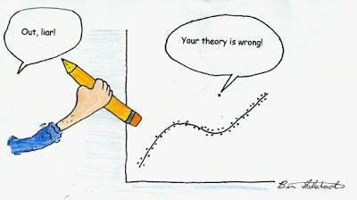
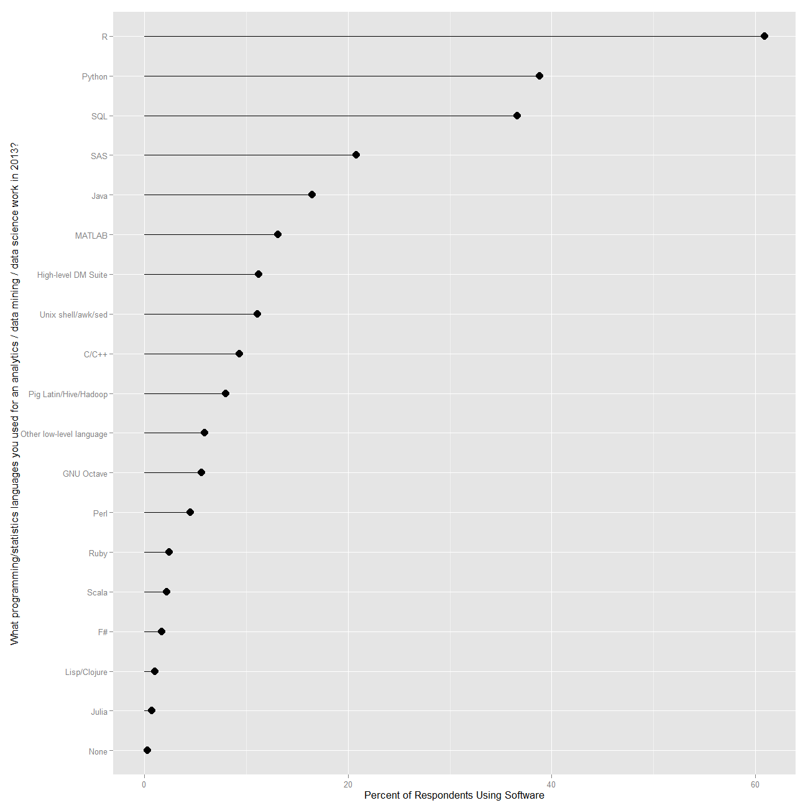
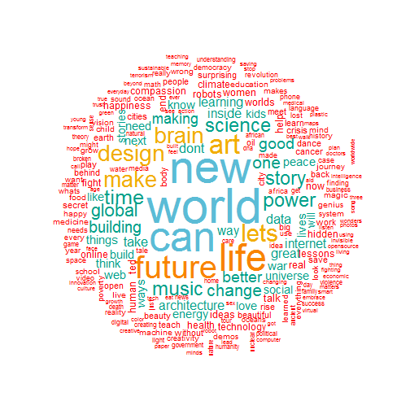

```{r global_options, include=FALSE}
library(ggplot2)
library(rCharts)
library(dplyr)
library(knitr)
library(xtable)
library(gridExtra)
library(ggthemes)
library(reshape2)
opts_chunk$set(echo=FALSE, warning=FALSE, message=FALSE)
```

## Quantitative Information

1. Numbers Don't Speak for Themselves - Need to be appropriately displayed
2. Reduces (at times, eliminates) guesswork, assumptions, gut instinct, intuition, and bias
3. Poor charts/graphs/tables are commonplace
4. No training

---  

## What is Visualization?

**[Kosara](http://eagereyes.org/criticism/definition-of-visualization)**

1. Based on non-visual data (not from pictures or image processing) - transforms invisible to visible
2. Should produce an image/object that communicates predominantly visually
3. Must be readable and recognizable- must provide a way to learn something about the data

*Few* : Quantitative displays to *[P]rovide reader with important, meaningful, and useful insight.* <br>

*Tufte* : Should serve a clear purpose - description, exploration, tabulation, or decoration

---
## Why bother with graphs when we have stats? - Anscombe's Quartet

```{r results='asis',echo=FALSE}

anscombe <- as.data.frame(anscombe)
anscombereorder <- anscombe[, c(1, 5, 2, 6, 3, 7, 4, 8)]
print(xtable(anscombereorder),type="html")
```

---

## Anscombe's Quartet - Statistics

```{r results='asis',echo=FALSE}
anscombelong <- data.frame(x = unlist(anscombe[, 1:4]), y = unlist(anscombe[, 
    5:8]), datasource = rep(1:4, each = 11))
stats=anscombelong %>% group_by(datasource) %>% summarise("x-mean" = mean(x), 
    "y-mean" = mean(y), "x-variance" = var(x), "y-variance" = var(y), "correlation-xy" = cor(x, 
        y))
print(xtable(stats), type= "html")
```

---
## Anscombe's Quartet - Graphs

```{r echo=FALSE}
# http://stackoverflow.com/questions/7549694/ggplot2-adding-regression-line-equation-and-r2-on-graph 
lm_eqn = function(m) {
  l <- list(a = format(coef(m)[1], digits = 2),
      b = format(abs(coef(m)[2]), digits = 2),
      r2 = format(summary(m)$r.squared, digits = 3));

  if (coef(m)[2] >= 0)  {
    eq <- substitute(italic(y) == a + b %.% italic(x)*","~~italic(r)^2~"="~r2,l)
  } else {
    eq <- substitute(italic(y) == a - b %.% italic(x)*","~~italic(r)^2~"="~r2,l)    
  }

  as.character(as.expression(eq));                 
}
ggplot(anscombelong, aes(x = x, y = y)) + geom_point() + geom_smooth(method = "lm", 
    se = FALSE) + annotate("text", x = 12, y = 4, label = lm_eqn(lm(y ~ 
    x, anscombelong)), color = "black", parse = TRUE) + ylim(3, 13) + xlim(4, 
    19) + facet_wrap(~datasource) + theme(legend.position = "none") + theme_bw()
```

---

## Why bother about visualizations today?

 

---

## Why bother about visualizations today?

Rise in Data-analysis Driven Journalism

* ESPN backed: **FiveThirtyEight.com**: Nate Silver (previously NYTimes)
* New York Times' **The Upshot** - David Leonhardt
* Vox media's **Vox.com** - Ezra Klein (WaPo), Matt Yglesias (slate.com)
* **Guardian's** data blog
* The Wall Street Journal 
* The Washington Post

---

## Why bother about visualizations today?


 

---

## Why bother about visualizations today?


 

---

## Why bother about visualizations today?

 

---

## What is R?

 |  | 
---------|----------|---------


1. A language and an environment for statistical computing and graphics
2. Based on **S** - now owned by TIBCO 
3. Elegance - Language for statisticians by statisticians

<a href="http://www.r-project.org" target="_blank"></a>

---

## Pluses

1. Free and Open Source -No reinvention of wheel and tinkering opportunities
2. Coding in R - Reproducibility 
3. Routines generally appear in R before any other statistical system

<center></center>
Source: [Muenchen, Robert A, The Popularity of Data Analysis Software.] (http://r4stats.com/articles/popularity/), Retrieved 8/15/2013

---

## Pluses Continued...

4. Graphics - Great.... to ....Mindblowing
5. Excellent package distribution system - Internet
6. Compatible with most flavors of Unix, Mac OSX, and Windows
7. Connectivity with database systems, import from different data formats
8. Community support is outstanding - user-base estimates of 250,000-2 million

<a href= "http://www.nytimes.com/2009/01/07/technology/business-computing/07program.html" target= "_blank"> Ashlee Vance's NY Times story of 2009</a></small>

---

## Limitations

1. Command line interface 
2. Help - IDEs: R Studio, Revolution Analytics and - GUI: Deducer and R Commander
3. Provides complete control over what happens but the learning curve could be steep

---

## Other Softwares - (SPSS, SAS, Stata,...)

1. Proprietory softwares, functions
2. Algorithms developed for users - tinkering/customization ability limited
3. Rectangular datasets and one at a time 
4. Expensive and costs escalate for additional options 

---
## R versus Others

Rexer Analytics survey |2013 KD Nuggets Poll
---------|----------
    
Source: [Muenchen, Robert A, The Popularity of Data Analysis Software.] (http://r4stats.com/articles/popularity/), Retrieved 9/1/2014 

---  

## R versus Others


 | </td> 
---------|----------

<supersub> Source: [Muenchen, Robert A, The Popularity of Data Analysis Software.] (http://r4stats.com/articles/popularity/), Retrieved 9/1/2014 

---  

## R Packages in Different Fields 

<iframe src="http://cran.r-project.org/web/views/" style="min-height: 700px; min-width: 950px;"></iframe>

Source: From the R Project site

---

## My website/blog

* http://patilv.github.io
* Topics of discussion include healthcare, sports, education, and crime, among others
* 2 Posts listed by ComputerWorld magazine as top resources for R statistical programming environment
* An invited post on kdnuggets.com 
* A post on NCAA college finances sought by collegeathleticsclips.com
* Visualizations have appeared on si.com

---

## NCAA Basketball- Gonzaga Bulldogs versus Kansas Jayhawks -PPG


---

## Textual Data - Titles of 1755 TED Talks


---

## Superbowl appearances - Wins and Losses

```{r eval=FALSE, echo=FALSE}
load("winlosstab.Rda")
   
nwl=nPlot(Count ~ Team, group="Win.Loss", data=winlosstab, type='multiBarChart')
nwl$chart(color=c("red","green"))
nwl$xAxis(rotateLabels=-45)
nwl$chart(reduceXTicks = FALSE)
nwl$chart(stacked=TRUE)
nwl$chart(margin = list(bottom = 150))
#nwl$publish("nwl",host="gist")
```
<iframe src="http://bl.ocks.org/patilv/raw/c2d199103dfd346380c4/" width=800 height=600> </iframe>

---

## Medicare Provider Charges in Spokane

<iframe src="http://glimmer.rstudio.com/vivekpatil/interactivemed/" width=800 height=600> </iframe>

---

## Enrollments in Modern languages

<iframe src="http://bl.ocks.org/patilv/raw/353108ff4913894d708b/" width=800 height=600> </iframe>

---

## Violent Crime Rates Across 5 Decades

<iframe src="http://patilv.github.io/choroplethanimation/decadeplots.html" width=800 height=600> </iframe>

---

## Campus Security

<iframe src="http://bl.ocks.org/patilv/raw/8148002/" width=800 height=600> </iframe>

---

## 2014 US Open Nationality of Players


---

## A Recently Released Video on R

From Revolution Analytics <br>  
<center>
<iframe width="640" height="360" src="http://www.youtube.com/embed/TR2bHSJ_eck?feature=player_embedded" frameborder="0" allowfullscreen></iframe>

---

## Welcome to the Journey

Read and summarize articles on "Perception and Graph Types": http://bit.ly/gudataviz
