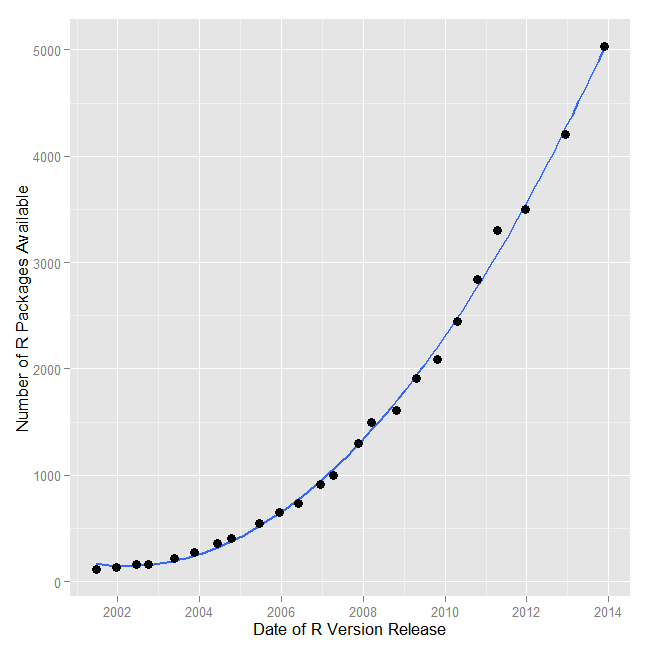

## Quantitative Information

1. Numbers Don't Speak for Themselves - Need to be appropriately displayed
2. Reduces (at times, eliminates) guesswork, assumptions, gut instinct, intuition, and bias
3. Poor charts/graphs/tables are commonplace
4. No training

---  

## What is Visualization?

**[Kosara](http://eagereyes.org/criticism/definition-of-visualization)**

1. Based on non-visual data (not from pictures or image processing) - transforms invisible to visible
2. Should produce an image/object that communicates predominantly visually
3. Must be readable and recognizable- must provide a way to learn something about the data

*Few* : Quantitative displays to *[P]rovide reader with important, meaningful, and useful insight.*  

*Tufte* : Should serve a clear purpose - description, exploration, tabulation, or decoration

---
## Why bother with graphs when we have stats? - Anscombe's Quartet

<!-- html table generated in R 3.1.1 by xtable 1.7-3 package -->
<!-- Tue Sep 02 17:09:32 2014 -->
<TABLE border=1>
<TR> <TH>  </TH> <TH> x1 </TH> <TH> y1 </TH> <TH> x2 </TH> <TH> y2 </TH> <TH> x3 </TH> <TH> y3 </TH> <TH> x4 </TH> <TH> y4 </TH>  </TR>
  <TR> <TD align="right"> 1 </TD> <TD align="right"> 10.00 </TD> <TD align="right"> 8.04 </TD> <TD align="right"> 10.00 </TD> <TD align="right"> 9.14 </TD> <TD align="right"> 10.00 </TD> <TD align="right"> 7.46 </TD> <TD align="right"> 8.00 </TD> <TD align="right"> 6.58 </TD> </TR>
  <TR> <TD align="right"> 2 </TD> <TD align="right"> 8.00 </TD> <TD align="right"> 6.95 </TD> <TD align="right"> 8.00 </TD> <TD align="right"> 8.14 </TD> <TD align="right"> 8.00 </TD> <TD align="right"> 6.77 </TD> <TD align="right"> 8.00 </TD> <TD align="right"> 5.76 </TD> </TR>
  <TR> <TD align="right"> 3 </TD> <TD align="right"> 13.00 </TD> <TD align="right"> 7.58 </TD> <TD align="right"> 13.00 </TD> <TD align="right"> 8.74 </TD> <TD align="right"> 13.00 </TD> <TD align="right"> 12.74 </TD> <TD align="right"> 8.00 </TD> <TD align="right"> 7.71 </TD> </TR>
  <TR> <TD align="right"> 4 </TD> <TD align="right"> 9.00 </TD> <TD align="right"> 8.81 </TD> <TD align="right"> 9.00 </TD> <TD align="right"> 8.77 </TD> <TD align="right"> 9.00 </TD> <TD align="right"> 7.11 </TD> <TD align="right"> 8.00 </TD> <TD align="right"> 8.84 </TD> </TR>
  <TR> <TD align="right"> 5 </TD> <TD align="right"> 11.00 </TD> <TD align="right"> 8.33 </TD> <TD align="right"> 11.00 </TD> <TD align="right"> 9.26 </TD> <TD align="right"> 11.00 </TD> <TD align="right"> 7.81 </TD> <TD align="right"> 8.00 </TD> <TD align="right"> 8.47 </TD> </TR>
  <TR> <TD align="right"> 6 </TD> <TD align="right"> 14.00 </TD> <TD align="right"> 9.96 </TD> <TD align="right"> 14.00 </TD> <TD align="right"> 8.10 </TD> <TD align="right"> 14.00 </TD> <TD align="right"> 8.84 </TD> <TD align="right"> 8.00 </TD> <TD align="right"> 7.04 </TD> </TR>
  <TR> <TD align="right"> 7 </TD> <TD align="right"> 6.00 </TD> <TD align="right"> 7.24 </TD> <TD align="right"> 6.00 </TD> <TD align="right"> 6.13 </TD> <TD align="right"> 6.00 </TD> <TD align="right"> 6.08 </TD> <TD align="right"> 8.00 </TD> <TD align="right"> 5.25 </TD> </TR>
  <TR> <TD align="right"> 8 </TD> <TD align="right"> 4.00 </TD> <TD align="right"> 4.26 </TD> <TD align="right"> 4.00 </TD> <TD align="right"> 3.10 </TD> <TD align="right"> 4.00 </TD> <TD align="right"> 5.39 </TD> <TD align="right"> 19.00 </TD> <TD align="right"> 12.50 </TD> </TR>
  <TR> <TD align="right"> 9 </TD> <TD align="right"> 12.00 </TD> <TD align="right"> 10.84 </TD> <TD align="right"> 12.00 </TD> <TD align="right"> 9.13 </TD> <TD align="right"> 12.00 </TD> <TD align="right"> 8.15 </TD> <TD align="right"> 8.00 </TD> <TD align="right"> 5.56 </TD> </TR>
  <TR> <TD align="right"> 10 </TD> <TD align="right"> 7.00 </TD> <TD align="right"> 4.82 </TD> <TD align="right"> 7.00 </TD> <TD align="right"> 7.26 </TD> <TD align="right"> 7.00 </TD> <TD align="right"> 6.42 </TD> <TD align="right"> 8.00 </TD> <TD align="right"> 7.91 </TD> </TR>
  <TR> <TD align="right"> 11 </TD> <TD align="right"> 5.00 </TD> <TD align="right"> 5.68 </TD> <TD align="right"> 5.00 </TD> <TD align="right"> 4.74 </TD> <TD align="right"> 5.00 </TD> <TD align="right"> 5.73 </TD> <TD align="right"> 8.00 </TD> <TD align="right"> 6.89 </TD> </TR>
   </TABLE>

---

## Anscombe's Quartet - Statistics

<!-- html table generated in R 3.1.1 by xtable 1.7-3 package -->
<!-- Tue Sep 02 17:09:32 2014 -->
<TABLE border=1>
<TR> <TH>  </TH> <TH> datasource </TH> <TH> x-mean </TH> <TH> y-mean </TH> <TH> x-variance </TH> <TH> y-variance </TH> <TH> correlation-xy </TH>  </TR>
  <TR> <TD align="right"> 1 </TD> <TD align="right">   1 </TD> <TD align="right"> 9.00 </TD> <TD align="right"> 7.50 </TD> <TD align="right"> 11.00 </TD> <TD align="right"> 4.13 </TD> <TD align="right"> 0.82 </TD> </TR>
  <TR> <TD align="right"> 2 </TD> <TD align="right">   2 </TD> <TD align="right"> 9.00 </TD> <TD align="right"> 7.50 </TD> <TD align="right"> 11.00 </TD> <TD align="right"> 4.13 </TD> <TD align="right"> 0.82 </TD> </TR>
  <TR> <TD align="right"> 3 </TD> <TD align="right">   3 </TD> <TD align="right"> 9.00 </TD> <TD align="right"> 7.50 </TD> <TD align="right"> 11.00 </TD> <TD align="right"> 4.12 </TD> <TD align="right"> 0.82 </TD> </TR>
  <TR> <TD align="right"> 4 </TD> <TD align="right">   4 </TD> <TD align="right"> 9.00 </TD> <TD align="right"> 7.50 </TD> <TD align="right"> 11.00 </TD> <TD align="right"> 4.12 </TD> <TD align="right"> 0.82 </TD> </TR>
   </TABLE>

---
## Anscombe's Quartet - Graphs

 

---

## Why bother about visualizations today?

 

---

## Why bother about visualizations today?

Rise in Data-analysis Driven Journalism

* ESPN backed: **FiveThirtyEight.com**: Nate Silver (previously NYTimes)
* New York Times' **The Upshot** - David Leonhardt
* Vox media's **Vox.com** - Ezra Klein (WaPo), Matt Yglesias (slate.com)
* **Guardian's** data blog
* The Wall Street Journal 
* The Washington Post

---

## Why bother about visualizations today?

 

---

## Why bother about visualizations today?

 

---

## Why bother about visualizations today?

 

---

## What is R?

 |  | 
---------|----------|---------

1. A language and an environment for statistical computing and graphics
2. Based on **S** - now owned by TIBCO 
3. Elegance - Language for statisticians by statisticians

---

## Pluses

1. Free and Open Source -No reinvention of wheel and tinkering opportunities
2. Coding in R - Reproducibility 
3. Routines generally appear in R before any other statistical system

Source: [Muenchen, Robert A, The Popularity of Data Analysis Software.] (http://r4stats.com/articles/popularity/), Retrieved 8/15/2013

---

## Pluses Continued...

4. Graphics - Great.... to ....Mindblowing
5. Excellent package distribution system - Internet
6. Compatible with most flavors of Unix, Mac OSX, and Windows
7. Connectivity with database systems, import from different data formats
8. Community support is outstanding - user-base estimates of 250,000-2 million

<a href= "http://www.nytimes.com/2009/01/07/technology/business-computing/07program.html" target= "_blank"> Ashlee Vance's NY Times story of 2009</a></small>

---

## Limitations

1. Command line interface 
2. Help - IDEs: R Studio, Revolution Analytics and - GUI: Deducer and R Commander
3. Provides complete control over what happens but the learning curve could be steep

---

## Other Softwares - (SPSS, SAS, Stata,...)

1. Proprietory softwares, functions
2. Algorithms developed for users - tinkering/customization ability limited
3. Rectangular datasets and one at a time 
4. Expensive and costs escalate for additional options 

---
## R versus Others

Rexer Analytics survey |2013 KD Nuggets Poll
---------|----------
    
Source: [Muenchen, Robert A, The Popularity of Data Analysis Software.] (http://r4stats.com/articles/popularity/), Retrieved 9/1/2014 

---  

## R versus Others

 | </td> 
---------|----------

<supersub> Source: [Muenchen, Robert A, The Popularity of Data Analysis Software.] (http://r4stats.com/articles/popularity/), Retrieved 9/1/2014 

---  

## R Packages in Different Fields 

<iframe src="http://cran.r-project.org/web/views/" style="min-height: 700px; min-width: 950px;"></iframe>

Source: From the R Project site

---

## My website/blog

* http://patilv.github.io
* Topics of discussion include healthcare, sports, education, and crime, among others
* 2 Posts listed by ComputerWorld magazine as top resources for R statistical programming environment
* An invited post on kdnuggets.com 
* A post on NCAA college finances sought by collegeathleticsclips.com
* Visualizations have appeared on si.com

---

## NCAA Basketball- Gonzaga Bulldogs versus Kansas Jayhawks -PPG

---

## Textual Data - Titles of 1755 TED Talks

---

## Superbowl appearances - Wins and Losses

<iframe src="http://bl.ocks.org/patilv/raw/c2d199103dfd346380c4/" width=800 height=600> </iframe>

---

## Medicare Provider Charges in Spokane

<iframe src="http://glimmer.rstudio.com/vivekpatil/interactivemed/" width=800 height=600> </iframe>

---

## Enrollments in Modern languages

<iframe src="http://bl.ocks.org/patilv/raw/353108ff4913894d708b/" width=800 height=600> </iframe>

---

## Violent Crime Rates Across 5 Decades

<iframe src="http://patilv.github.io/choroplethanimation/decadeplots.html" width=800 height=600> </iframe>

---

## Campus Security

<iframe src="http://bl.ocks.org/patilv/raw/8148002/" width=800 height=600> </iframe>

---

## 2014 US Open Nationality of Players

---

## A Recently Released Video on R

From Revolution Analytics    

<iframe width="640" height="360" src="http://www.youtube.com/embed/TR2bHSJ_eck?feature=player_embedded" frameborder="0" allowfullscreen></iframe>

---

## Welcome to the Journey

Read and summarize articles on "Perception and Graph Types": http://bit.ly/gudataviz
